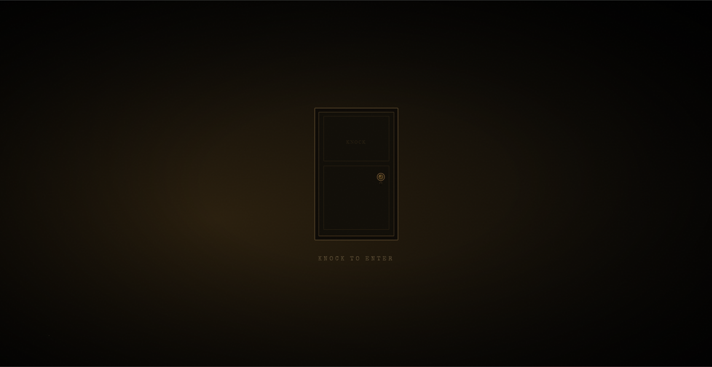
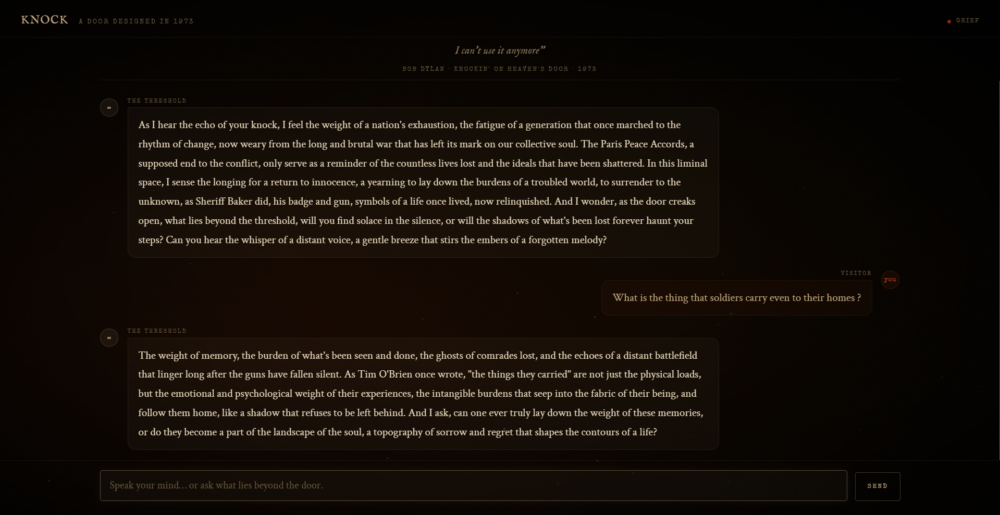
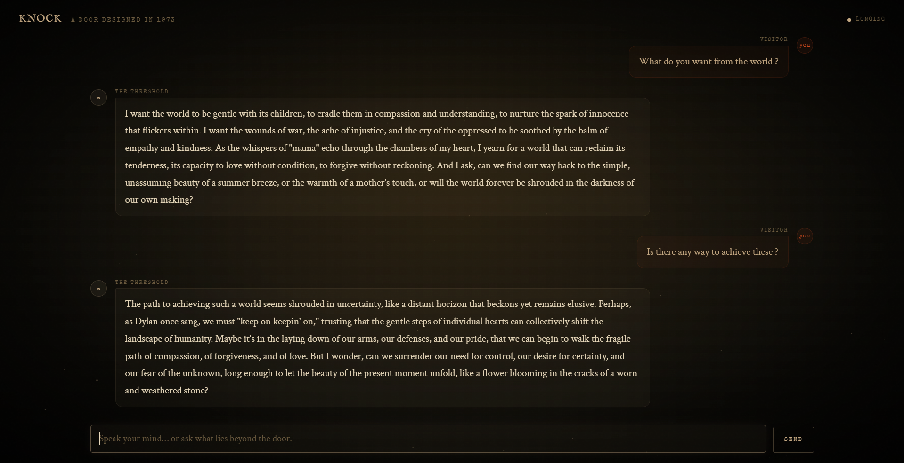

# KNOCK — Design Your Door

> *"Mama, take this badge off of me / I can't use it anymore."*
> — Bob Dylan, Knockin' on Heaven's Door (1973)

**CSE 358 Introduction to Artificial Intelligence · Creative Project · Spring 2025–2026**

---

## What This Is

**KNOCK** is a dark, atmospheric interactive web experience built around Bob Dylan's 1973 song "Knockin' on Heaven's Door." The user approaches a door, knocks, and enters into a conversation with a poetic AI voice that speaks from the threshold — grounded in the historical and cultural context of 1973: the Vietnam War, the counterculture, Sam Peckinpah's film *Pat Garrett & Billy the Kid*, and Dylan's own retreat from public life.

As the conversation unfolds, the page's visual atmosphere responds in real time to the emotional register of the exchange — shifting between states of grief, longing, exhaustion, tenderness, defiance, wonder, and release.

---

## AI Techniques Used

This project combines **two distinct generative AI techniques**, deeply integrated:

### Technique 1 — LLM with RAG-Style Historical Context Injection
A Claude language model (`claude-sonnet-4-20250514`) receives a dense system prompt on every request. This prompt saturates the model with historical context: the Paris Peace Accords of January 1973, Dylan's biography, Peckinpah's film, the exhaustion of the counterculture, and the specific emotional weight of the dying sheriff scene for which the song was written. The model speaks not as Dylan, but as *the threshold itself* — a presence shaped by that era.

### Technique 2 — Embedded Sentiment Analysis (Visual Atmosphere Engine)
Within the same API call, the model performs live sentiment analysis of each conversation turn. Every response includes a structured JSON block (stripped before display) classifying the emotional register:
- `sentiment`: `"dark"` | `"neutral"` | `"hopeful"`
- `mood`: `"grief"` | `"longing"` | `"defiance"` | `"tenderness"` | `"wonder"` | `"exhaustion"` | `"release"`

This data drives real-time visual transformations: background atmosphere shifts, color pulses, mood indicators. The page is not static — it *reads* the conversation and responds to it.

**Integration:** The two techniques are not independent. The sentiment analysis is informed by the same historical persona as the text generation — "exhaustion" here means the specific exhaustion of 1973, not generic tiredness. The visual output is a continuous emotional reading of the conversation.

---

## Technical Architecture

```
User Input
    │
    ▼
[Browser JS]
    │── builds conversation history (multi-turn)
    │── prepends dense historical system prompt
    ▼
[Anthropic Groq API · llama-3.3-70b-versatile]
    │
    ▼
[Raw Response]
    │── Prose reply (displayed to user)
    │── JSON block { sentiment, mood } (parsed, stripped from display)
    ▼
[Visual Engine]
    │── applyMood() → shifts CSS classes on #atmosphere
    │── Sentiment flash overlay (radial gradient pulse)
    │── Mood indicator (dot color + label)
```

**No build tools required.** The entire application is a single HTML file with vanilla JavaScript.

---

## Installation & Setup

### Prerequisites
- A modern web browser (Chrome, Firefox, Safari, Edge)

### Running Locally

```bash
# Clone the repository
git clone https://github.com/Mythogenik/The-Door.git
cd The-Door

# Option 1: Open directly (most browsers allow this for single-file HTML)
open index.html

# Option 2: Serve locally (recommended to avoid CORS issues)
python3 -m http.server 8080
# Then open http://localhost:8080 in your browser

```

### API Key

This project uses the **Groq API** (free, no credit card required). The API key is hardcoded directly in `index.html` — just change 'Your-API-KEY" with your real API key.
 
---

## Dependencies

| Dependency | Type | Purpose |
|---|---|---|
| Groq API (Llama 3.3 70B) | External API | LLM + sentiment analysis |
| Google Fonts (IM Fell English, Special Elite, Crimson Text) | CDN | Typography |
| Vanilla JS | Built-in | All interaction logic |

**No npm. No build step. No framework.** One HTML file.

---

## File Structure

```
The-Door/
├── index.html        # The entire artwork (single file)
├── MANIFESTO.md      # Artist's manifesto (1,500–2,000 words)
└── README.md         # This file
```

---

## Example Outputs

**Conversation example (grief/dark mood):**
> *User:* What do soldiers carry home that they can never put down?
>
> *The Threshold:* Everything they never got to bury properly. The ones who didn't make it back — they live in the survivor's hands, in the way he flinches at certain sounds, in the weight of the badge he was given for something he'd rather forget. The war ended in January. The men came home. Nobody told them how to stop fighting inside.

**Mood state examples:**
- 🟤 `exhaustion` — dim amber atmosphere, dark vignette
- 🔘 `listening` — neutral, softly lit
- 🟡 `wonder` — warm parchment pulse, lightened background





---

## Academic Integrity

All AI tools used are documented above. The creative vision, system prompt design, sentiment architecture, and all code were authored by me. The model generates text; I directed, curated, and gave it meaning via prompt.

Historical references consulted:
- *Pat Garrett & Billy the Kid* (Sam Peckinpah, 1973)
- Dylan's Nobel Prize lecture (2016)
- Paris Peace Accords documentation (January 27, 1973)
- Greil Marcus, *Like a Rolling Stone: Bob Dylan at the Crossroads* (2005)
- Howard Sounes, *Down the Highway: The Life of Bob Dylan* (2011)

---

## Author

Gökhan Şendaş · 20210808063 · CSE 358 · Spring 2025–2026

*"The door is yours to design. What's behind it is yours to discover."*
